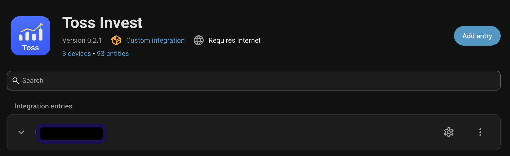
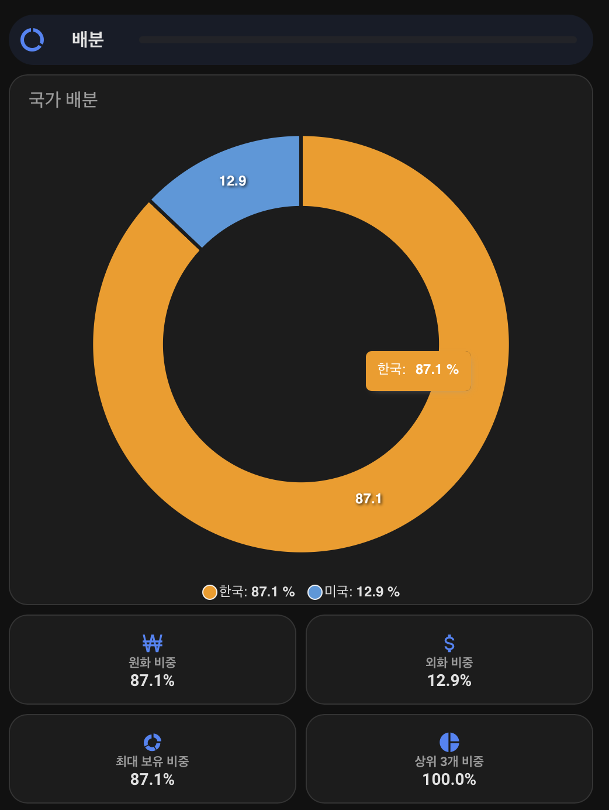
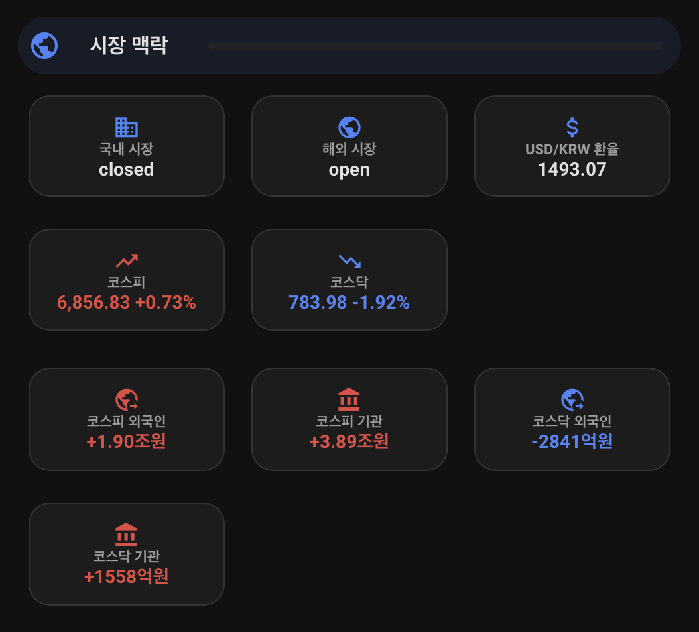

# Toss Invest for Home Assistant

[](https://github.com/hacs/integration)
[](https://www.home-assistant.io)
[](https://www.python.org)
[](LICENSE)

Toss Securities Open API를 통해 사용자의 **보유 자산, 실시간 시세, 시장 지표 및 경고**를 Home Assistant 엔티티로 제공하는 **비공식 커스텀 통합 구성요소(Custom Integration)**입니다. Home Assistant 2026.7.2 이상과 Python 3.14 이상을 지원합니다.

> [!IMPORTANT]
> **본 통합구성요소는 읽기 전용(Read-Only)입니다.**
> OAuth 토큰 발급을 제외한 모든 데이터 요청은 `GET` 방식으로만 이루어지며, 주문 조회, 주문 생성, 정정, 취소, 또는 자동매매 등 **주문 관련 기능(No Order Endpoint)은 일절 구현되어 있지 않습니다.** Toss Securities 또는 Home Assistant 공식 통합이 아닙니다.

---

## ✨ 주요 특징 (Key Features)

- **보유 자산 모니터링**: 포트폴리오의 평가 금액, 총/일일 수익률, 자산 배분(KR/US 및 KRW/USD) 및 상위 1·3종목 집중도를 제공합니다.
- **실시간 주식 시세**: 보유 중인 국내 및 해외(미국) 주식의 현재가, 평균 매수가, 수량, 평가액, 비용 전후 손익을 실시간으로 추적합니다.
- **시장 지표**: KOSPI, KOSDAQ 지수와 개인/외국인/기관/기타법인의 투자 주체별 순매수 현황을 연동합니다.
- **스마트 경고 (Alerts)**: 일일 변동성, 수익률 임계값, 신고가/신저가 근접 여부, 낙폭(Drawdown), 거래량 급증 등의 경고 이벤트를 제공합니다.
- **개인정보 보호 (Privacy Mode)**: 대시보드 화면상에서 중요 금액 및 평가 내역을 숨길 수 있는 프라이버시 스위치를 지원합니다.

---

## 🛠️ 설치 방법 (Installation)

### 방법 1: HACS를 이용한 설치 (권장)

HACS(Home Assistant Community Store)를 사용하면 매우 간편하게 설치하고 최신 버전을 유지할 수 있습니다.

1. Home Assistant 사이드바에서 **HACS** 메뉴로 이동합니다.
2. 우측 상단의 **점 3개 메뉴(...)**를 클릭하고 **Custom repositories (사용자 지정 저장소)**를 선택합니다.
3. 아래 정보를 입력하여 저장소를 추가합니다:
   - **Repository**: `https://github.com/inganyoyo/ha-toss-invest`
   - **Type**: `Integration`
4. 저장소가 등록되면 **Toss Invest**를 찾아서 다운로드합니다.
5. 다운로드가 완료되면 **Home Assistant를 재시작**합니다.

### 방법 2: 수동 설치 (Manual Installation)

HACS를 사용하지 않고 직접 코드를 복사하여 설치하는 방법입니다.

1. 본 저장소를 다운로드하거나 복제(Clone)합니다.
2. 다운로드한 소스코드의 `custom_components/toss_invest` 디렉터리를 통째로 Home Assistant의 구성 폴더(`<config_dir>/custom_components/toss_invest`)로 복사합니다.
   ```text
   config/
   └── custom_components/
       └── toss_invest/
           ├── __init__.py
           ├── manifest.json
           └── ...
   ```
3. 복사가 완료되면 **Home Assistant를 재시작**합니다.

---

## 🚀 빠른 시작 및 설정 (Quick Start)

### 1단계: API 자격 증명 발급
1. [Toss Securities Open API](https://openapi.tossinvest.com/) 개발자 센터에 로그인합니다.
2. OAuth `client_id`와 `client_secret`을 발급받습니다.

### 2단계: 통합 구성요소 추가 및 인증
1. Home Assistant에서 **설정(Settings) > 기기 및 서비스(Devices & services)**로 이동합니다.
2. 우측 하단의 **통합 구성요소 추가(Add integration)**를 선택합니다.
3. 검색창에 **Toss Invest**를 입력하고 선택합니다.
4. 발급받은 `client_id`와 `client_secret`을 입력합니다.
5. 다음 단계에서 연동할 **계좌(account_seq)**를 선택하여 구성을 마칩니다.
   *(참고: client_secret은 내부적으로 안전하게 보호되며, 만료 시 재인증 흐름을 지원합니다.)*




### 3단계: 상세 옵션 구성
통합 구성요소 카드의 **구성(Configure)** 버튼을 클릭하여 장중 주기, 보유 자산 동기화 주기, 개인정보 모음, 경고/알림 임계값 등의 상세 작동 옵션을 사용자 정의할 수 있습니다.

> [!TIP]
> 상세 설정 옵션 정보와 엔티티 기본값 정보는 [configuration.md](docs/configuration.md) 문서에서 자세히 확인할 수 있습니다.

---

## 📊 대시보드 및 알림 자동화 (Dashboards & Automations)

### Lovelace 대시보드 카드
포트폴리오 조회를 돕기 위한 2가지 YAML 템플릿 뷰를 제공합니다:
- **기본형 (`dashboards/toss-invest-native.yaml`)**: 추가 프론트엔드 카드 설치 없이 기본 카드만 사용하여 깔끔하게 표현합니다.
- **고급형 (`dashboards/toss-invest-enhanced.yaml`)**: 더 풍부한 정보 표현 및 종목별 일봉 차트를 제공합니다. HACS Frontend에서 아래 구성요소를 추가로 설치해야 합니다.
  - [button-card 7.0.1](https://github.com/custom-cards/button-card/releases/tag/v7.0.1)
  - [auto-entities 1.16.1](https://github.com/thomasloven/lovelace-auto-entities/releases/tag/v1.16.1)
  - [apexcharts-card 2.2.3](https://github.com/RomRider/apexcharts-card/releases/tag/v2.2.3)
  - [layout-card 2.4.7](https://github.com/thomasloven/lovelace-layout-card/releases/tag/v2.4.7)

| **자산 배분 현황** | **실시간 시장 맥락** |
| :---: | :---: |
|  |  |

> 상세 구성 방법과 카드별 연동 가이드는 [dashboards/README.md](dashboards/README.md) 문서를 참고해 주세요.

### 경고 자동화 (Blueprint)
- `blueprints/automation/toss_invest_alert.yaml` 스크립트를 사용하여 `event.toss_invest_portfolio_alert` 이벤트를 스마트폰 푸시 알림 등으로 자동 전달하도록 설정할 수 있습니다.

---

## 🔒 보안 및 개인정보 (Security & Privacy)

- **인증 정보 노출 주의**: `client_secret`을 YAML 파일, 대시보드 설정, GitHub Issue, 또는 디버그 로그 등에 노출하지 마세요.
- **프라이버시 모드 (Privacy Mode)**:
  - `switch.toss_invest_portfolio_privacy_mode` 엔티티를 활용하여 화면상에서 자산 규모를 `••••` 형태로 가릴 수 있습니다.
  - 단, 이는 화면상의 **표시 제한**이며 데이터 자체가 복호화 불가능하게 가려지거나 API 접근을 차단하는 권한 분리가 아닙니다. 상세 사항은 [privacy.md](docs/privacy.md)를 참고하세요.
- **레코더 용량 최적화 (Recorder)**:
  - 빈번한 가격 갱신으로 인한 데이터베이스 크기 증가를 줄이기 위해 `docs/recorder.md`를 참고하여 불필요한 엔티티나 `daily_candles` 히스토리 제외(exclude) 설정을 적용하세요.

---

## 🛠️ 문제 해결 및 개발 (Troubleshooting & Dev)

- API 속도 제한(Rate Limit), 429 에러, 데이터 지연 또는 재인증 요청 발생 시 대응 가이드는 [troubleshooting.md](docs/troubleshooting.md)를 확인하세요.
- 로컬 개발 환경 검증 명령어:
  ```bash
  python -m pip install -e '.[dev]' 'homeassistant==2026.7.2'
  pytest -q
  ruff check .
  ruff format --check .
  mypy custom_components/toss_invest
  ```

### Release Maintenance
HACS validation currently uses `ignore: brands` **only** while this project is distributed as a custom repository. This temporary exception **MUST be removed** after the integration is registered in `home-assistant/brands`. Dependabot checks SHA-pinned GitHub Actions weekly. Maintainers must manually review and update python tooling compatibility-tool pins on the same schedule.

---

## 📂 관련 문서 (Documentation)

- [⚙️ 상세 설정 가이드 (Configuration & Entity defaults)](docs/configuration.md)
- [🔒 개인정보 및 자격 증명 (Privacy)](docs/privacy.md)
- [💾 레코더 제외 설정 (Recorder)](docs/recorder.md)
- [🔍 문제 해결 (Troubleshooting)](docs/troubleshooting.md)

---

## 📄 라이선스 (License)

본 프로젝트는 [MIT 라이선스](LICENSE)에 따라 제공됩니다.
