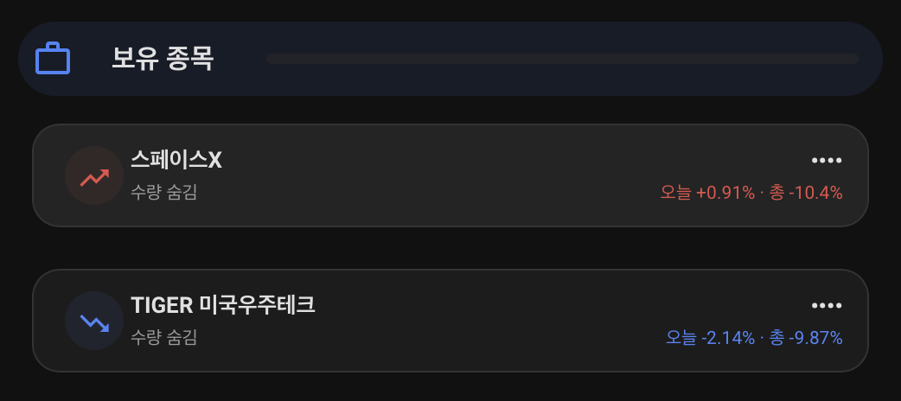

# Toss Invest 대시보드

두 파일은 각각 `Toss 주식` **단일 view**만 담고 있습니다. 파일 전체를 기존 Raw
configuration에 덮어쓰지 말고, 기존 `views:` 목록 아래에 선택한 파일의 첫 번째
`- title: Toss 주식` 블록을 붙여 `홈`, `전기`, `시스템`, `차량`, `로또` 다음
**여섯 번째 view**로 삽입하세요. 기존 설정에 `path: toss-invest`가 있으면 경로를
바꿔야 합니다.

## 📸 대시보드 미리보기 (Previews)

고급형 대시보드(`toss-invest-enhanced.yaml`)를 적용했을 때의 실제 구성 예시입니다. 프라이버시 모드(Privacy Mode)가 켜지면 중요 금액 정보가 자동으로 마스킹 처리됩니다.

| **자산 요약 (프라이버시 모드)** | **보유 종목 (프라이버시 모드)** |
| :---: | :---: |
|  |  |

| **자산 배분 (원화/외화)** | **시장 맥락 (지수 및 주체별 순매수)** |
| :---: | :---: |
|  |  |

---

## 두 버전

- `toss-invest-native.yaml`: Home Assistant 기본 카드만 사용합니다. 선택 엔티티가 없으면
  조건부 카드가 숨겨집니다. 동적 보유 종목 목록과 가격 차트는 제공하지 않으므로 필요한
  비금액 엔티티를 UI 편집기에서 직접 추가하세요.
- `toss-invest-enhanced.yaml`: 보유 종목, 시장 데이터와 경고를 자동 탐색하고 2열
  데스크톱/1열 모바일 레이아웃 및 선택 종목 일봉 차트를 제공합니다.

Enhanced 버전은 HACS Frontend에서 아래 리소스를 설치하고 Lovelace Resources에
등록해야 합니다. 다음은 Home Assistant 2026.7.2 조합의 검증 기준 버전입니다. 업그레이드
후에는 데스크톱·모바일과 라이트·다크 테마를 다시 확인하세요.

- [button-card 7.0.1](https://github.com/custom-cards/button-card/releases/tag/v7.0.1)
- [auto-entities 1.16.1](https://github.com/thomasloven/lovelace-auto-entities/releases/tag/v1.16.1)
- [apexcharts-card 2.2.3](https://github.com/RomRider/apexcharts-card/releases/tag/v2.2.3)
- [layout-card 2.4.7](https://github.com/thomasloven/lovelace-layout-card/releases/tag/v2.4.7)

리소스가 없으면 enhanced view만 렌더링되지 않습니다. 통합과 native 대시보드는 custom
card와 독립적입니다.

## 선택 종목과 선택 사항

보유 종목 ID는 표시 이름에서 동적으로 만들어지므로 enhanced 파일은 `integration:
toss_invest`와 접미사 패턴으로 탐색합니다. 선택 종목 상세를 쓰려면 엔티티 레지스트리에서
보고 싶은 종목의 `sensor.<종목 이름>_daily_candles`를 **하나만** 활성화하세요. 같은
종목의 `one_week_return`, `one_month_return`, `one_year_return`, `period_high`,
`period_low`, `drawdown`, `historical_volatility`도 필요한 항목만 켭니다. 여러 종목의
`daily_candles`를 켜면 차트가 각각 표시됩니다.

주문 가능 금액과 수동 새로고침은 통합 옵션을 켰을 때만 생성됩니다. enhanced의
auto-entities와 native의 조건부 카드는 엔티티가 없으면 해당 컨트롤을 숨깁니다. 시장
순위도 `enable_rankings` 옵션이 켜져 있을 때만 생성되며, 채권 지표와 순위 엔티티는
Recorder 증가를 줄이기 위해 기본 비활성화입니다.

## 테마와 등락 표현

카드는 Home Assistant의 표면·텍스트 변수를 기본값으로 사용합니다. 아래 변수를 테마에
추가하면 상승/하락/중립, 테두리와 그림자를 조정할 수 있습니다. 라이트 테마에서는
`toss-card-glow: none`, 다크 테마에서는 낮은 불투명도의 그림자를 권장합니다. 등락은
색상만 사용하지 않으며 enhanced 보유 종목 카드의 일일·총수익률은 양수에 `+`를 붙이고
음수와 0은 원래 부호와 수치를 유지합니다.

```yaml
toss-gain-color: "#d32f2f"
toss-loss-color: "#1565c0"
toss-neutral-color: "var(--primary-color)"
toss-card-border-color: "var(--divider-color)"
toss-card-glow: "0 4px 18px rgba(0, 0, 0, 0.18)"
```

## 개인정보 보호 제한

`switch.toss_invest_portfolio_privacy_mode`가 켜지면 대시보드의 평가 금액, 손익, 현재가,
주문 가능 금액, 투자자 순매수, 가격 차트와 기간 고가·저가가 `••••` 또는 숨김 처리됩니다.
하지만 화면 가림일 뿐 **권한 경계**가 아닙니다. 원본 센서는 바뀌지 않으므로 해당 사용자는
개발자 도구, 엔티티 상세, 자동화, API 또는 Recorder **기록**에서 금액을 볼 수 있습니다.
실제 접근 제어는 Home Assistant 사용자와 대시보드 권한으로 구성하세요.

## 알림 블루프린트

`blueprints/automation/toss_invest_alert.yaml`을 automation blueprint 경로에 복사한 뒤
`event.toss_invest_portfolio_alert`와 실행할 action을 선택합니다. action에서는
`event_type`과 `alert_payload`의 `symbol`, `severity`, `source_timestamp`, `observed`,
`threshold`를 사용할 수 있습니다. 비금액 경고에는 해당 관측값과 임계값이 전달되지만,
금액 경고의 `observed`와 `threshold`는 항상 생략되어 `None`입니다. 인증정보와 계좌
식별자도 전달하지 않습니다.

## 개발 검증

YAML 파싱, Home Assistant blueprint 스키마와 입력 치환, 개인정보/선택 엔티티/차트 계약은
자동 테스트로 확인합니다. 실제 브라우저의 라이트·다크 1440px/390px 렌더 검증은
`dev/compose.yaml` 개발 인스턴스에서 수행하며 운영 Home Assistant에는 적용하지 않습니다.
