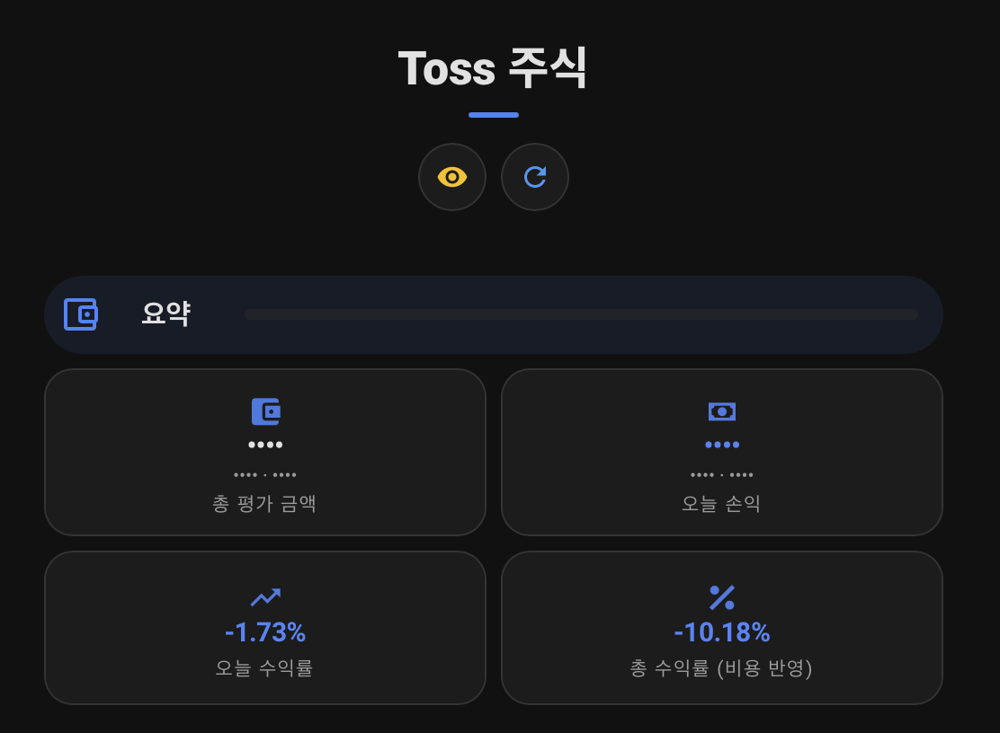

# Privacy and credential handling

## Credential storage

OAuth `client_id`, `client_secret`와 선택한 `account_seq`는 Home Assistant config entry의
data로 저장됩니다. 일반적으로 `<config>/.storage/core.config_entries`에 있으므로 `.storage`
전체를 비밀 데이터로 다루고 안전한 백업, 최소 사용자 권한과 파일 권한을 적용하세요.
`client_secret`을 Git, issue, screenshot, automation trace 또는 dashboard YAML에 복사하지
마세요. 노출되었다면 Toss에서 즉시 폐기·재발급하고 integration을 재인증하세요.

액세스 토큰은 메모리에서 관리되며 로그에 기록하지 않습니다. debug 로그를 공유할 때도
Authorization header, OAuth 값, 계좌 식별자와 실제 평가 금액을 직접 확인하고 삭제하세요.

## Read-only boundary

이 릴리스의 client는 OAuth token exchange의 POST를 제외하면 공개 조회 API의 GET만
호출합니다. 주문, 정정, 취소, 주문내역 또는 자동매매 endpoint와 service/action은
없습니다. 이 보장은 현재 릴리스 코드 범위이며 Toss 계정 자체의 권한을 대체하지 않습니다.
가능하면 Toss 측에서도 최소 권한 credential을 사용하세요.

## Privacy mode

**Privacy mode is not an authorization boundary**입니다. 제공 dashboard에서 평가액,
현재가, 손익, 매수 가능 금액과 차트를 가리는 presentation control입니다. 원본 sensor
state를 변경하지 않으며 Developer Tools, WebSocket/REST API, entity detail, automation,
history, backup 및 Recorder database 접근자는 원래 값을 볼 수 있습니다.

*(프라이버시 모드가 활성화된 대시보드 예시)*

실제 분리는 Home Assistant 사용자/관리자 권한, 별도 dashboard 접근, 네트워크 통제와
백업 암호화로 수행하세요. Privacy mode가 unknown/unavailable이면 제공 dashboard는
fail-safe로 금액을 가리지만 이것도 접근 제어는 아닙니다.

## Alerts

Monetary alert의 `observed`와 `threshold`는 event payload에서 **always omitted**이며 이를
활성화하는 사용자 옵션은 없습니다. blueprint는 없는 값을 `None`으로 전달합니다. 향후
payload 정책이 바뀌더라도 notification 대상과 automation trace 보존 기간을 함께 검토해야
합니다.

Recorder 최소화 예시는 [recorder.md](recorder.md)를 참고하세요.
